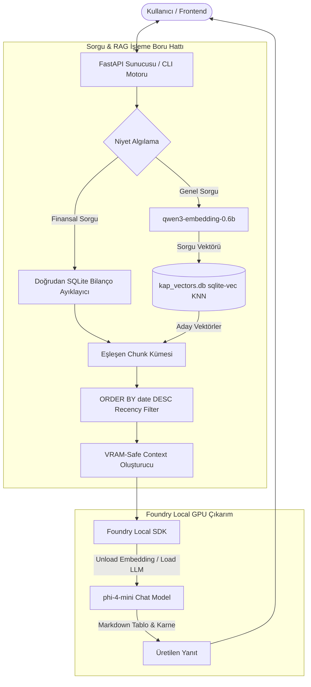

# KAP RAG — Sistem Mimarisi ve Çalışma Mantığı 📐

Bu doküman, **KAP RAG** sisteminin teknik mimarisini, veri işleme boru hattını (pipeline), bellek (VRAM) yönetim stratejisini ve hibrit arama algoritmalarını detaylandırır.

---

## 🏗️ Genel Mimari Şeması



---

## 💾 Veri İndeksleme ve Saklama Katmanı

Projedeki veri işleme boru hattı 4 ana aşamadan oluşur:

### 1. KAP JSON Veri Kümesi (`KAP_DATA/`)
- `KAP_DATA/<SIRKET_KODU>/<BILDIRIM_ID>.json` yapısında saklanan 22.701 adet ham KAP bildirimi.
- Her JSON dosyası bildirim başlığı, tarihi (`2026-08-05 08:00:21`), şirket kodu, bildirim türü (`FR`, `ODA`, `DG`, `DUY`), metin içeriği ve ekler (attachments) bilgisini barındırır.

### 2. Akıllı Metin Parçalama (`chunker.py`)
- **Finansal Raporlar (`FR`):** Bilanço ve Gelir Tabloları yapısı bozulmayacak şekilde daha geniş chunk boyutlarıyla (`1500-2500` karakter) parçalanır. Tablo başlıkları (`kap-fr_...`) korunur.
- **Özel Durum Açıklamaları (`ODA` / `DG`):** `800-1200` karakterlik semantik bloklara bölünür.
- Toplam 22.701 bildirimden **95.387 adet vektör parçası (chunk)** üretilir.

### 3. Vektör Gömme (Embedding) ve SQLite Kaydı (`index_foundry.py`)
- `qwen3-embedding-0.6b` modeli (1024 boyutlu vektör çıktısı) ile tüm metin parçaları vektörleştirilir.
- Veriler `sqlite-vec` eklentisi yüklü SQLite veritabanına (`kap_vectors.db`) yazılır.

---

## 🗄️ Veritabanı Şeması (`kap_vectors.db`)

Veritabanı 2 ana tablodan oluşur:

### 1. Metadata ve Metin Tablosu (`chunks`)
```sql
CREATE TABLE chunks (
    id INTEGER PRIMARY KEY AUTOINCREMENT,
    source_index INTEGER,
    company TEXT,
    company_name TEXT,
    title TEXT,
    date TEXT,               -- Format: "YYYY.MM.DD HH:MM:SS" (Tarih Sıralaması İçin)
    type TEXT,               -- Bildirim Türü: 'FR', 'ODA', 'DG', 'DUY'
    source_url TEXT,
    source_type TEXT,        -- 'content' veya 'pdf_attachment'
    attachment_filename TEXT,
    text TEXT
);
```

### 2. Vektör Arama Tablosu (`vec_chunks`)
```sql
CREATE VIRTUAL TABLE vec_chunks USING vec0(
    id INTEGER PRIMARY KEY,
    embedding float[1024]
);
```

---

## ⚡ VRAM Yönetimi ve Model Offloading (Foundry Local)

Sistem, 6 GB VRAM'e sahip **NVIDIA RTX 4050** gibi kısıtlı GPU ortamlarında donanım taşmalarını (`500 InternalServerError / BFCArena::AllocateRawInternal Failed`) engellemek için **Dinamik Model Yükleme/Boşaltma (Model Offloading)** tekniğini uygular:

1. **Adım 1 (Embedding):** Sorgu geldiğinde `foundry model load qwen3-embedding-0.6b` çalıştırılır. Vektör oluşturulduktan hemen sonra `foundry model unload qwen3-embedding-0.6b` çağrılarak GPU belleği tamamen temizlenir.
2. **Adım 2 (Chat LLM):** GPU VRAM sıfırlandıktan sonra `foundry model load phi-4-mini` çalıştırılır ve çıkarım yapılır.
3. **Context Sınırı:** LLM'e iletilen metin bağlamı VRAM koruması amacıyla maksimum 4-5 chunk (~3.500 karakter) ile sınırlandırılır.

---

## 🕒 Recency-First (Güncellik Odaklı) Hibrit Arama Algoritması

Klasik RAG sistemleri yalnızca vektör yakınlığına (cosine similarity) odaklandığından eski bildirimleri üst sıralara getirebilir. KAP RAG bu sorunu **Recency-First Hibrit Arama** ile çözer:

```python
# 1. Aşama: Geniş Vektör Aday Kümesi (KNN)
vec_rows = db.execute(
    "SELECT v.id, v.distance FROM vec_chunks v WHERE v.embedding MATCH ? ORDER BY v.distance LIMIT ?",
    (q_blob, top_k * 15)
).fetchall()

# 2. Aşama: Kronolojik Tarih Sıralaması
sql = f"SELECT * FROM chunks WHERE id IN ({placeholders})"
sql += " ORDER BY date DESC"  -- En güncel bildirimler en üste gelir (2026 -> 2025 -> 2024)
```

---

## 🎯 Doğrudan Veri Ayıklama Motoru (Zero Hallucination)

Finansal bilançolarda modelin ezber cevap vermesini engellemek için **`extract_real_financial_facts`** fonksiyonu devreye girer:
- SQLite içerisindeki `FR` metinlerini taranarak `TOPLAM DÖNEN VARLIKLAR`, `KISA VADELİ YÜKÜMLÜLÜKLER`, `UZUN VADELİ YÜKÜMLÜLÜKLER`, `TOPLAM ÖZKAYNAKLAR` ve `HASILAT` satırlarının karşısındaki **gerçek sayısal değerler** (örn: `585.069 Bin TL`) regex ile çekilir.
- Bu gerçek veriler doğrudan LLM context'ine aktarılır, böylece model hayali rakamlar üretemez.
