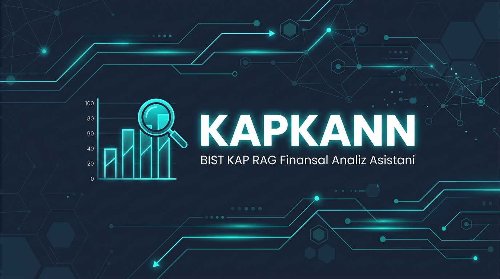

<p align="center">
  
</p>

<h1 align="center">KAPKANN</h1>

<p align="center">
  <strong>🏦 BİST Şirketleri İçin Yerel AI Destekli KAP Bildirim Analiz Sistemi</strong>
</p>

<p align="center">
  <a href="#-özellikler"></a>
  <a href="#-veri-seti"></a>
  <a href="#-veri-seti"></a>
  <a href="#-teknoloji-stacki"></a>
  <a href="#-teknoloji-stacki"></a>
</p>

<p align="center">
  <em>
    KAP (Kamu Aydınlatma Platformu) üzerindeki BİST şirket bildirimlerini<br>
    tamamen yerelde çalışan RAG (Retrieval-Augmented Generation) pipeline'ı ile sorgulayan,<br>
    5 farklı finansal analiz modunda profesyonel raporlar üreten akıllı asistan.
  </em>
</p>

---

## 📋 İçindekiler

- [✨ Özellikler](#-özellikler)
- [🖥️ Ekran Görüntüleri](#️-ekran-görüntüleri)
- [📊 Veri Seti](#-veri-seti)
- [🏗️ Mimari](#️-mimari)
- [⚙️ Teknoloji Stack'i](#️-teknoloji-stacki)
- [🚀 Kurulum](#-kurulum)
- [📖 Kullanım](#-kullanım)
- [🔌 API Referansı](#-api-referansı)
- [📁 Proje Yapısı](#-proje-yapısı)
- [🗺️ Yol Haritası](#️-yol-haritası)
- [📄 Lisans](#-lisans)

---

## ✨ Özellikler

### 🤖 5 Spesifik Finansal Analiz Modu

| Mod | Açıklama | Çıktı |
|:---:|:---------|:------|
| 📊 **Bilanço & Likidite** | Dönen/Duran varlıklar, borçlar, özkaynak analizi | Cari oran, finansal skor kartı |
| 📈 **Gelir Tablosu & Karlılık** | Hasılat, faaliyet karı, net dönem karı | Marj analizi, karlılık skoru |
| 💰 **Temettü & Sermaye Artırımı** | Kar payı dağıtım kararları, bedelsiz/bedelli | Hisse başı brüt/net tutarlar |
| 🤝 **Yeni İş & Yatırım** | Sözleşmeler, ihaleler, kapasite yatırımları | Ciroya etki analizi |
| 📰 **Genel KAP Özeti** | Genel kurul, yönetim kararları, haberler | Maddeli bildirim özeti |

### 🔑 Temel Yetenekler

- **🔒 %100 Yerel Çalışma** — Cloud API veya API key gerektirmez, tüm AI işlemleri RTX 4050 GPU üzerinde çalışır
- **⚡ Dual Provider** — Yerel Foundry (phi-4-mini) veya Groq Cloud (Qwen3-27B) arasında geçiş
- **🧠 Akıllı Intent Detection** — Sorunuzu otomatik olarak 5 analiz modundan birine yönlendirir
- **📋 Gerçek Veri Ayıklama** — Finansal raporlardan bilanço kalemlerini regex ile otomatik çıkarır
- **💾 Sorgu Önbelleği** — Tekrarlanan sorular için 7 gün cache, anlık yanıt
- **🌐 Modern Web UI** — Responsive, dark mode, markdown rendering, BİST 100 canlı veri
- **📱 Mobil Uyumlu** — Sidebar navigasyon, touch-friendly tasarım

---

## 📊 Veri Seti

| Metrik | Değer |
|--------|-------|
| **Toplam Bildirim** | 22,701 JSON dosya |
| **Şirket Sayısı** | 191 BİST şirketi |
| **Bildirim Türleri** | ODA (Özel Durum), FR (Finansal Rapor), DG (Diğer) |
| **PDF Ekleri** | 12,344 dosya (%31.4 bildirimde) |
| **Veri Kaynağı** | [KAP — Kamu Aydınlatma Platformu](https://www.kap.org.tr) |
| **Kapsanan Şirketler** | THYAO, AKBNK, ASELS, EREGL, TUPRS, SISE, BIMAS ve 184+ diğer |

### JSON Bildirim Şeması

```json
{
  "id": "4028328d916b98a0019173be88fb375d",
  "index": 1326563,
  "company": "THYAO",
  "company_name": "TÜRK HAVA YOLLARI A.O.",
  "title": "Finansal Duran Varlık Edinimi",
  "date": "2024.08.21 10:20:42",
  "type": "ODA",
  "summary": "Yeni Şirket Kuruluş Kararı",
  "content": "Finansal Duran Varlık Edinimi...",
  "attachments": [
    {
      "id": "4028328c919f164a0191dc7aba063579",
      "filename": "SPK_RAPORU.pdf",
      "extension": "pdf",
      "url": "https://www.kap.org.tr/tr/api/file/download/..."
    }
  ],
  "url": "https://www.kap.org.tr/tr/Bildirim/1326563"
}
```

---

## 🏗️ Mimari

```
┌─────────────────────────────────────────────────────────────────┐
│                    📥 İNDEKSLEME (Tek Seferlik)                 │
│                                                                 │
│  KAP_DATA/*.json ──► content alanı                              │
│       │                                                         │
│       ▼                                                         │
│  ┌─────────────────────────────────────────────┐                │
│  │  RecursiveChunker (1500 char, 200 overlap)  │                │
│  │  + Metadata: company, type, date            │                │
│  └────────────────────┬────────────────────────┘                │
│                       ▼                                         │
│  ┌─────────────────────────────────────────────┐                │
│  │  qwen3-embedding-0.6b → 1024-dim vektör     │                │
│  └────────────────────┬────────────────────────┘                │
│                       ▼                                         │
│  ┌─────────────────────────────────────────────┐                │
│  │  SQLite + sqlite-vec  (kap_vectors.db)       │                │
│  │  ├── chunks (metadata + metin)               │                │
│  │  └── vec_chunks (float[1024] embedding)      │                │
│  └─────────────────────────────────────────────┘                │
└─────────────────────────────────────────────────────────────────┘

┌─────────────────────────────────────────────────────────────────┐
│                    🔍 SORGULAMA (Her İstek)                      │
│                                                                 │
│  Kullanıcı Sorusu + Şirket/Tür Filtresi                        │
│       │                                                         │
│       ▼                                                         │
│  [Intent Detection] → Bilanço / Gelir / Temettü / Yatırım / Genel
│       │                                                         │
│       ▼                                                         │
│  [qwen3-embedding-0.6b] → Sorgu Vektörü                        │
│       │                                                         │
│       ▼                                                         │
│  [sqlite-vec MATCH + WHERE filtresi] → Top-K Chunk              │
│       │                                                         │
│       ▼                                                         │
│  [Finansal Veri Ayıklama] → Gerçek bilanço rakamları            │
│       │                                                         │
│       ▼                                                         │
│  [phi-4-mini / Groq Qwen3-27B] → Kaynaklı Profesyonel Rapor    │
│       │                                                         │
│       ▼                                                         │
│  JSON: { answer, sources[], chunks_used, intent }               │
└─────────────────────────────────────────────────────────────────┘
```

---

## ⚙️ Teknoloji Stack'i

| Katman | Teknoloji | Açıklama |
|--------|-----------|----------|
| **AI Runtime** | [Microsoft Foundry Local](https://github.com/microsoft/foundry) | Yerel GPU üzerinde model çalıştırma (WinML) |
| **Embedding** | `qwen3-embedding-0.6b` | 478 MB, 1024 boyutlu vektörler |
| **Chat LLM (Yerel)** | `phi-4-mini` | 3.6 GB, tool calling destekli |
| **Chat LLM (Cloud)** | `qwen/qwen3.6-27b` (Groq) | Daha güçlü Türkçe, cloud tabanlı |
| **Vector DB** | SQLite + [`sqlite-vec`](https://github.com/asg017/sqlite-vec) | Tek dosya DB, native vektör arama |
| **Backend** | [FastAPI](https://fastapi.tiangolo.com/) + Uvicorn | Async REST API |
| **Frontend** | Vanilla HTML/CSS/JS | Dark mode, responsive, Markdown rendering |
| **Chunking** | Custom RecursiveCharacterTextSplitter | Tablo & finansal rapor korumalı |

---

## 🚀 Kurulum

### Ön Gereksinimler

- **Python 3.10+**
- **NVIDIA GPU** (RTX 4050 veya üstü önerilir)
- **Microsoft Foundry Local** yüklü ve çalışır durumda
- **Git** (opsiyonel)

### 1. Projeyi Klonla

```bash
git clone https://github.com/erenbozyer/kapkann.git
cd kapkann
```

### 2. Sanal Ortam Oluştur & Bağımlılıkları Kur

```bash
python -m venv .venv

# Windows
.venv\Scripts\activate

# macOS / Linux
source .venv/bin/activate

pip install -r requirements.txt
```

### 3. Foundry Local'ı Başlat

```bash
# Foundry servisini başlat
foundry service start

# Gerekli modelleri indir
foundry model download qwen3-embedding-0.6b
foundry model download phi-4-mini
```

### 4. Vektör Veritabanını İndeksle

```bash
# KAP_DATA klasöründeki tüm bildirimleri indeksle
python index_foundry.py

# Özel parametrelerle:
python index_foundry.py --data-dir ./KAP_DATA --db kap_vectors.db --batch-size 32
```

> ⏱️ **Tahmini Süre:** ~22,701 bildirim × 3-5 chunk = ~70,000-110,000 vektör. RTX 4050'de yaklaşık **15-30 dakika**.

### 5. Sunucuyu Başlat

```bash
# Varsayılan ayarlarla (port 8000)
python server.py

# Özel port ve Groq API anahtarı ile
python server.py --port 3000 --groq-key gsk_YOUR_KEY_HERE
```

🌐 Tarayıcıda açın: **http://localhost:8000**

---

## 📖 Kullanım

### 🌐 Web Arayüzü

Sunucuyu başlattıktan sonra **http://localhost:8000** adresinde modern web arayüzüne erişin:

- **KAP AI Asistanı** — Sohbet formatında finansal soru-cevap
- **BİST 100 Canlı** — Anlık piyasa verileri
- **Şirket Filtresi** — Sidebar'dan şirket seçimi
- **Model Seçimi** — Yerel (Foundry) / Cloud (Groq) arası geçiş

### 💻 CLI (Komut Satırı)

```bash
# Genel soru
python ask_foundry.py "THYAO son KAP bildirimlerinde öne çıkanlar nelerdir?"

# Şirket filtreli bilanço sorusu
python ask_foundry.py "Bilanço ve borçluluk durumu nasıl?" --company THYAO

# Temettü sorgusu
python ask_foundry.py "Temettü dağıtacak mı?" --company EREGL

# Yerel model ile çalıştır
python ask_foundry.py "Ciro ve net kar performansı" --company TUPRS --provider local
```

### 📝 Örnek Soru Şablonları

| Mod | Örnek Soru |
|-----|------------|
| 📊 Bilanço | *"THYAO bilanço ve borçluluk durumu nasıl?"* |
| 📈 Gelir | *"TUPRS ciro ve net dönem karı ne kadar?"* |
| 💰 Temettü | *"EREGL temettü dağıtacak mı, kar payı kararı var mı?"* |
| 🤝 Yatırım | *"ASELS yeni iş ilişkisi veya sözleşme duyurdu mu?"* |
| 📰 Genel | *"AKBNK son KAP bildirimlerinde öne çıkanlar nelerdir?"* |

---

## 🔌 API Referansı

### Soru Sorma

```http
POST /api/ask
Content-Type: application/json
```

```json
{
  "question": "THYAO bilanço ve borçluluk durumu nasıl?",
  "company": "THYAO",
  "type": null,
  "top_k": 15
}
```

**Yanıt:**
```json
{
  "answer": "📋 **THYAO Bilanço & Likidite Karnesi · 2024/9**\n⭐ **Genel Skor:** 4.2/5...",
  "sources": [
    {
      "company": "THYAO",
      "title": "Finansal Rapor",
      "date": "2024.11.08",
      "url": "https://www.kap.org.tr/tr/Bildirim/1340842",
      "source_type": "content"
    }
  ],
  "chunks_used": 15,
  "query_time_ms": 3200.5,
  "intent": "BILANCO"
}
```

### Diğer Endpoint'ler

| Yöntem | Endpoint | Açıklama |
|--------|----------|----------|
| `GET` | `/api/companies` | Tüm şirket kodlarını listeler |
| `GET` | `/api/stats` | DB istatistikleri (chunk, şirket sayısı) |
| `GET` | `/api/models` | Aktif embedding ve chat model bilgisi |
| `GET` | `/api/bist100` | BİST 100 canlı piyasa verileri |
| `POST` | `/api/set-provider` | AI provider değiştir (local/groq) |

---

## 📁 Proje Yapısı

```
kapkann/
├── 📄 server.py              # FastAPI backend + 5 analiz modu + Web UI
├── 📄 ask_foundry.py          # RAG sorgu motoru (CLI + modül)
├── 📄 index_foundry.py        # Vektör indeksleme (JSON → embed → SQLite)
├── 📄 chunker.py              # Akıllı metin bölme (tablo korumalı)
├── 📄 analyze_attachments.py  # PDF ek analiz scripti
├── 📄 requirements.txt       # Python bağımlılıkları
├── 📄 sablonlar.md            # 5 analiz modu soru şablonları rehberi
├── 📄 implementation_plan.md  # Detaylı uygulama planı
│
├── 📂 public/                 # Web UI (Frontend)
│   ├── index.html             # Ana sayfa (sidebar + chat + BİST 100)
│   ├── style.css              # Dark mode, glassmorphism, animasyonlar
│   └── app.js                 # Frontend mantığı (fetch, markdown, UI)
│
├── 📂 KAP_DATA/               # Ham bildirim verileri (gitignore'da)
│   ├── THYAO/                 # (171 JSON dosya)
│   ├── AKBNK/
│   ├── ASELS/
│   └── ... (191 şirket klasörü, 22,701 JSON)
│
├── 📂 Documents/              # Proje dokümanları ve görseller
│
└── 🗄️ kap_vectors.db          # SQLite vektör veritabanı (gitignore'da)
```

---

## 🗺️ Yol Haritası

- [x] **Faz 1 — Content RAG** — 22,701 bildirimin metin içeriği ile çalışan RAG sistemi
- [x] **5 Analiz Modu** — Bilanço, Gelir, Temettü, Yatırım, Genel
- [x] **Gerçek Veri Ayıklama** — Finansal raporlardan otomatik bilanço kalemi çıkarma
- [x] **Sorgu Önbelleği** — 7 gün TTL ile tekrarlanan sorulara anlık yanıt
- [x] **Web UI** — Dark mode, responsive, markdown rendering
- [x] **Dual Provider** — Yerel Foundry + Groq Cloud desteği
- [x] **BİST 100 Canlı Veri** — Anlık piyasa bilgileri
- [ ] **Faz 2 — PDF Extraction** — 12,344 PDF ekin içeriğini RAG'a ekleme
- [ ] **Karşılaştırmalı Analiz** — Birden fazla şirketi karşılaştırma
- [ ] **Zaman Serisi Analizi** — Dönemler arası performans takibi
- [ ] **Otomatik Rapor Üretimi** — Periyodik şirket raporları

---

## 🛠️ Geliştirme

### Gereksinimler

```
foundry-local-sdk-winml
sqlite-vec
numpy
fastapi
uvicorn[standard]
PyMuPDF
requests
```

### Foundry Model Listesi

```bash
# Mevcut modelleri listele
foundry model list

# Kullanılan modeller:
# - qwen3-embedding-0.6b  (478 MB)  — Embedding
# - phi-4-mini             (3.6 GB)  — Yerel Chat LLM
# - qwen3-8b              (5.5 GB)  — Güçlü Türkçe (opsiyonel)
```

---

## 🤝 Katkıda Bulunma

1. Bu repo'yu **fork** edin
2. Feature branch oluşturun (`git checkout -b feature/yeni-ozellik`)
3. Değişikliklerinizi commit edin (`git commit -m 'feat: yeni özellik eklendi'`)
4. Branch'i push edin (`git push origin feature/yeni-ozellik`)
5. **Pull Request** açın

---

## 📄 Lisans

Bu proje eğitim ve kişisel kullanım amaçlıdır. KAP verileri [Kamu Aydınlatma Platformu](https://www.kap.org.tr)'na aittir.

---

<p align="center">
  <strong>KAPKANN</strong> ile BİST şirketlerinin KAP bildirimlerini yapay zeka ile analiz edin. 🚀
</p>
